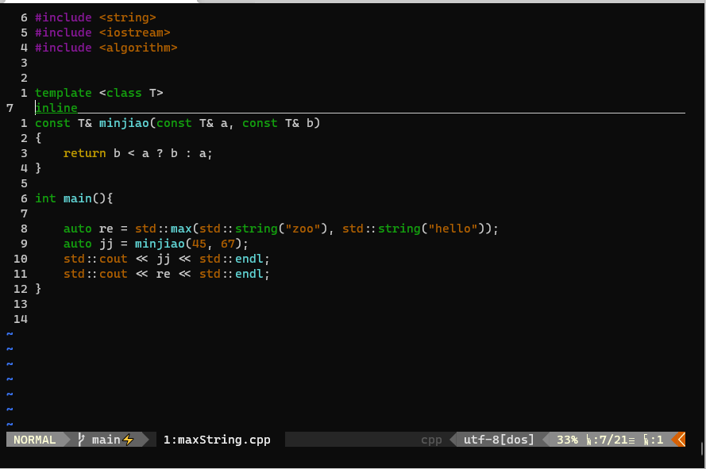

# Vimrc
Vimrc

下载后，需要先装下vundle，安装好之后进入vim模式，用PluginInstall命令就能安装插件了，等插件安装完就可以正常使用了。

```bash
git clone https://github.com/VundleVim/Vundle.vim.git ~/.vim/bundle/Vundle.vim
```



## 安装Windows Terminal
在Windows上要使用这个主题必须安装Terminal不然显示会不正常，呈错误的红色；

安装完Terminal，就是一些列的配置了，首先安装posh-git

```bas
Install-Module posh-git
Install-Module oh-my-posh

```

然后再安装oh-my-posh，这个和知乎上写得都不一样，安装方式已经改了，再下面这个链接上有详细的说明

```bash
https://ohmyposh.dev/docs/installation/windows
```

最后需要再$PROFILE，生成的文件里加上下面这几行，就相当于设置主题也加上了，每次打开都会有

```bash
Import-Module posh-git
Import-Module oh-my-posh
Set-PoshPrompt Paradox
```
